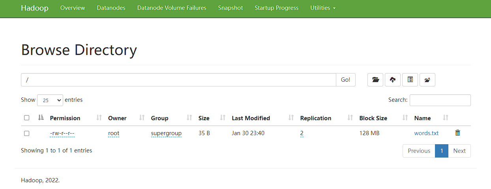
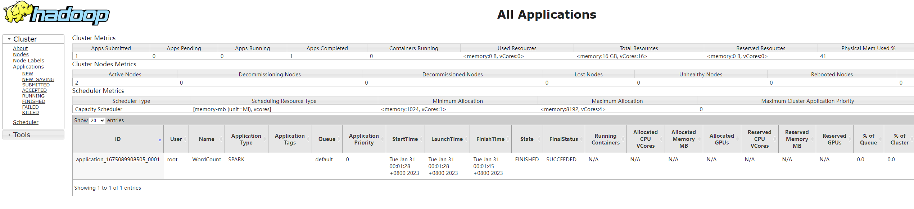

> 本文主要参考：知乎 “芥子屋” 的文章，在此基础上实践修改。<br>
> 原文链接：https://zhuanlan.zhihu.com/p/421375012

## Docker 部署 Spark + Hadoop 3 一主二从集群

#### 1. 确定 Hadoop 版本
```shell
$ pyspark
>>> sc._gateway.jvm.org.apache.hadoop.util.VersionInfo.getVersion()
'3.3.2'
```

#### 2. 获取 Hadoop 3.3.2 的安装包，下载地址：https://archive.apache.org/dist/hadoop/common/hadoop-3.3.2/hadoop-3.3.2.tar.gz
   > 注：推荐使用中科大镜像:<br>
   > https://mirrors.ustc.edu.cn/apache/hadoop/common/hadoop-3.3.2/hadoop-3.3.2.tar.gz
   
#### 3. 准备配置文件及启动脚本
- 在工作目录下创建 config 文件夹（如：mkdir /opt/docker/spark/config）
- 在 config 目录下编写需要覆盖的 Hadoop 配置文件（具体配置见 /spark/config）
  ```shell
  $tree
  .
  ├── core-site.xml
  ├── hadoop-env.sh
  ├── hdfs-site.xml
  ├── mapred-site.xml
  ├── ssh_config
  ├── workers
  └── yarn-site.xml
  
  0 directories, 7 files
  ```
- 准备 Hadoop 启动脚本（start-hadoop.sh）
  ```bash
  #!/bin/bash
  # 启动 ssh 服务（用于 ssh 免密通信）
  service ssh start
  # 依次启动 HDFS 和 YARN 集群
  $HADOOP_HOME/sbin/start-dfs.sh
  $HADOOP_HOME/sbin/start-yarn.sh
  ```

#### 4. 基于 bitnami/spark 构建新镜像
- 在工作目录下创建 Dockerfile
  ```dockerfile
  FROM docker.io/bitnami/spark:3.3
  LABEL description="Docker image with Spark (3.3.1) and Hadoop (3.3.2), based on bitnami/spark:3.3 ."

  USER root

  # 设置 Hadoop 环境变量
  ENV HADOOP_HOME="/opt/hadoop"
  ENV HADOOP_CONF_DIR="$HADOOP_HOME/etc/hadoop"
  ENV HADOOP_LOG_DIR="/var/log/hadoop"
  ENV PATH="$HADOOP_HOME/sbin:$HADOOP_HOME/bin:$PATH"

  WORKDIR /opt

  # 更换镜像源
  # RUN sed -i 's/deb.debian.org/mirrors.ustc.edu.cn/g' /etc/apt/sources.list
  RUN mv /etc/apt/sources.list /etc/apt/sources.list.backup && \
      echo "deb http://mirrors.ustc.edu.cn/debian stable main contrib non-free" >> /etc/apt/sources.list && \
      echo "# deb-src http://mirrors.ustc.edu.cn/debian stable main contrib non-free" >> /etc/apt/sources.list && \
      echo "deb http://mirrors.ustc.edu.cn/debian stable-updates main contrib non-free" >> /etc/apt/sources.list && \
      echo "# deb-src http://mirrors.ustc.edu.cn/debian stable-updates main contrib non-free" >> /etc/apt/sources.list && \
      echo "# deb http://mirrors.ustc.edu.cn/debian stable-proposed-updates main contrib non-free" >> /etc/apt/sources.list && \
      echo "# deb-src http://mirrors.ustc.edu.cn/debian stable-proposed-updates main contrib non-free" >> /etc/apt/sources.list

  # 安装 SSH 服务和 curl
  RUN apt-get update && \ 
      apt-get install -y openssh-server && \
      apt-get install -y curl

  # 配置免密登陆
  RUN ssh-keygen -t rsa -f /root/.ssh/id_rsa -P '' && \
      cat /root/.ssh/id_rsa.pub >> /root/.ssh/authorized_keys

  # 下载安装 Hadoop
  RUN curl -OL https://mirrors.ustc.edu.cn/apache/hadoop/common/hadoop-3.3.2/hadoop-3.3.2.tar.gz
  RUN tar -zxvf hadoop-3.3.2.tar.gz && \
      mv hadoop-3.3.2 hadoop && \
      rm -rf hadoop-3.3.2.tar.gz && \
      mkdir /var/log/hadoop

  # 创建 HDFS NameNode 和 DataNode 工作目录
  RUN mkdir -p /root/hdfs/namenode && \
      mkdir -p /root/hdfs/datanode 

  COPY config/* /tmp/

  # 拷贝文件，并覆盖 $HADOOP_CONF_DIR 目录下的 Hadoop 配置文件
  RUN mv /tmp/ssh_config /etc/ssh/ssh_config.d/my_ssh.conf && \
      mv /tmp/start-hadoop.sh /opt/start-hadoop.sh && \
      mv /tmp/hadoop-env.sh $HADOOP_CONF_DIR/hadoop-env.sh && \
      mv /tmp/hdfs-site.xml $HADOOP_CONF_DIR/hdfs-site.xml && \
      mv /tmp/core-site.xml $HADOOP_CONF_DIR/core-site.xml && \
      mv /tmp/mapred-site.xml $HADOOP_CONF_DIR/mapred-site.xml && \
      mv /tmp/yarn-site.xml $HADOOP_CONF_DIR/yarn-site.xml && \
      mv /tmp/workers $HADOOP_CONF_DIR/workers

  # 设置为可执行文件
  RUN chmod +x /opt/start-hadoop.sh && \
      chmod +x $HADOOP_HOME/sbin/start-dfs.sh && \
      chmod +x $HADOOP_HOME/sbin/start-yarn.sh

  # 格式化 HDFS 文件系统
  RUN hdfs namenode -format

  ENTRYPOINT [ "/opt/bitnami/scripts/spark/entrypoint.sh" ]
  CMD [ "/opt/bitnami/scripts/spark/run.sh" ]
  ```
- 构建 Spark-Hadoop:3 镜像
  ```shell
  $ docker image build -t spark-hadoop:3 .
  ...
  => => writing image sha256:f82aa532bb561ba6af6c531bf42e5c6e2de9b59957db04dbf0696478b0aa26a4 
  => => naming to docker.io/library/spark-hadoop:3 
  ```
  > 注：windows 下 build 镜像前，请确保 hadoop-env.sh 等文件的行尾字符为 `LF` 而不是 `CRLF`（在 VSCode 右下角可以看到），否则会 build 出错。因为在 linux 环境下换行符是 `\n` 而不是 `\r\n`，`sh` 脚本中含有 `\r\n` 时运行会报错 `$'\r': command not found`

#### 5. 启动 spark-hadoop 集群
- 构建完镜像后，修改 `docker-compose.yml` 文件（windows 环境下需要修改 volumes 位置）
  ```yml
  version: '3'

  services:
    spark:
      image: spark-hadoop:3
      hostname: master
      environment:
        - SPARK_MODE=master
        - SPARK_RPC_AUTHENTICATION_ENABLED=no
        - SPARK_RPC_ENCRYPTION_ENABLED=no
        - SPARK_LOCAL_STORAGE_ENCRYPTION_ENABLED=no
        - SPARK_SSL_ENABLED=no
      volumes:
        - /opt/docker/spark/share:/opt/share
      ports:
        - '8080:8080'
        - '4040:4040'
        - '8088:8088'
        - '8042:8042'
        - '9870:9870'
        - '19888:19888'
    spark-worker-1:
      image: spark-hadoop:3
      hostname: worker1
      environment:
        - SPARK_MODE=worker
        - SPARK_MASTER_URL=spark://master:7077
        - SPARK_WORKER_MEMORY=1G
        - SPARK_WORKER_CORES=1
        - SPARK_RPC_AUTHENTICATION_ENABLED=no
        - SPARK_RPC_ENCRYPTION_ENABLED=no
        - SPARK_LOCAL_STORAGE_ENCRYPTION_ENABLED=no
        - SPARK_SSL_ENABLED=no
      volumes:
        - /opt/docker/spark/share-worker1:/opt/share
      ports:
        - '8081:8081'
    spark-worker-2:
      image: spark-hadoop:3
      hostname: worker2
      environment:
        - SPARK_MODE=worker
        - SPARK_MASTER_URL=spark://master:7077
        - SPARK_WORKER_MEMORY=1G
        - SPARK_WORKER_CORES=1
        - SPARK_RPC_AUTHENTICATION_ENABLED=no
        - SPARK_RPC_ENCRYPTION_ENABLED=no
        - SPARK_LOCAL_STORAGE_ENCRYPTION_ENABLED=no
        - SPARK_SSL_ENABLED=no
      volumes:
        - /opt/docker/spark/share-worker2:/opt/share
      ports:
        - '8082:8081'
  ```
- 使用 `docker-compose` 命令启动集群
  ```shell
  $ docker-compose up -d
  [+] Running 4/4
   - Network spark_default             Created
   - Container spark-spark-1           Started
   - Container spark-spark-worker-1-1  Started
   - Container spark-spark-worker-2-1  Started
  ``` 
- 查看是否启动成功
  ```shell
  $ docker ps
  CONTAINER ID   IMAGE            COMMAND                  CREATED         STATUS         PORTS                                                                                                                                              NAMES
  157f998fa66f   spark-hadoop:3   "/opt/bitnami/script…"   2 minutes ago   Up 2 minutes   0.0.0.0:4040->4040/tcp, 0.0.0.0:8042->8042/tcp, 0.0.0.0:8080->8080/tcp, 0.0.0.0:8088->8088/tcp, 0.0.0.0:9870->9870/tcp, 0.0.0.0:19888->19888/tcp   spark-spark-1
  bf5a055d5083   spark-hadoop:3   "/opt/bitnami/script…"   2 minutes ago   Up 2 minutes   0.0.0.0:8082->8081/tcp                                                                                                                             spark-spark-worker-2-1
  86771deb01bb   spark-hadoop:3   "/opt/bitnami/script…"   2 minutes ago   Up 2 minutes   0.0.0.0:8081->8081/tcp                                                                                                                             spark-spark-worker-1-1
  ```
- 启动容器集群后，进入容器开启 SSH 服务（Hadoop 需要 SSH 服务来管理集群），Worker 容器类似操作不在赘述 **（该步骤待优化）**
  ```shell
  # 进入 docker 容器，157f998fa66f 替换成对应的容器 id
  $ docker exec -it 157f998fa66f bash
  # 查看 SSH 服务是否启动
  root@master:/opt# service ssh status
  sshd is not running ... failed!
  # 启动 SSH 服务
  root@master:/opt# service ssh start
  Starting OpenBSD Secure Shell server: sshd.
  root@master:/opt# service ssh status
  sshd is running.
  ```
- 进入 master 容器执行启动脚本
  ```shell
  # 进入 master 容器
  $ docker exec -it 157f998fa66f bash
  # 执行 Hadoop 启动脚本
  root@master:/opt# ./start-hadoop.sh
  Starting namenodes on [master]
  master: Warning: Permanently added 'master,172.18.0.4' (ECDSA) to the list of known hosts.
  master: WARNING: /opt/hadoop/logs does not exist. Creating.
  Starting datanodes
  worker2: Warning: Permanently added 'worker2,172.18.0.3' (ECDSA) to the list of known hosts.
  worker1: Warning: Permanently added 'worker1,172.18.0.2' (ECDSA) to the list of known hosts.
  worker2: WARNING: /opt/hadoop/logs does not exist. Creating.
  worker1: WARNING: /opt/hadoop/logs does not exist. Creating.
  Starting secondary namenodes [master]
  2023-01-30 14:45:05,962 WARN util.NativeCodeLoader: Unable to load native-hadoop library for your platform..using builtin-java classes where applicable
  Starting resourcemanager
  Starting nodemanagers
  ```
- 查看 Hadoop 集群是否启动成功
  ```shell
  # master 容器中运行的Java进程
  root@master:/opt# jps
  900 ResourceManager
  615 SecondaryNameNode
  1259 Jps
  62 Master
  366 NameNode

  # worker1 容器中运行的Java进程 (worker2 类似)
  root@worker1:/opt# jps
  361 NodeManager
  234 DataNode
  60 Worker
  542 Jps
  ```

  至此 spark + hadoop 一主二从集群环境已经搭建成功。

<br>

------

<br>

> 以下内容为运行一些示例 demo

<br>

#### 向 HDFS 写入文件
- 准备一个 words.txt 文件到 master 容器（内容可以随意）
  ```shell
  root@master:/opt/share# cat words.txt
  Hello world
  i am spark
  Hello spark
  ```
- 使用命令将共享文件中的 words.txt 写入 HDFS
  ```shell
  root@master:/opt# hadoop fs -put /opt/share/words.txt /
  ```
- 查看文件是否写入成功
  ```shell
  root@master:/opt# hdfs dfs -ls /
  2023-01-30 15:40:58,234 WARN util.NativeCodeLoader: Unable to load native-hadoop library for your platform... using builtin-java classes where applicable
  Found 1 items
  -rw-r--r--   2 root supergroup         35 2023-01-30 15:40 /words.txt
  ```
- 同时，写入的文件也可以在 HDFS Web UI 上进行浏览，访问： `your ip:9870`（如：`http://localhost:9870/explorer.html`）
  

#### Spark 访问 HDFS
现在，可以通过 Spark 访问 HDFS 了，访问 URI 为 `hdfs://master:9000` ，这是配置在 core-site.xml 文件中默认的文件系统 `fs.defaultFS`。下面通过 PySpark 演示如何读取和存储 `HDFS` 上的数据。
- 读取 words.txt 并以空格分割后保存
  ``` shell
  root@master:/opt# pyspark
  Python 3.8.16 (default, Jan 17 2023, 17:15:28) 
  [GCC 10.2.1 20210110] on linux
  Type "help", "copyright", "credits" or "license" for more information.
  Setting default log level to "WARN".
  To adjust logging level use sc.setLogLevel(newLevel). For SparkR, use setLogLevel(newLevel).
  23/01/30 15:51:47 WARN NativeCodeLoader: Unable to load native-hadoop library for your platform... using builtin-java   classes where applicable
  Welcome to
        ____              __
       / __/__  ___ _____/ /__
      _\ \/ _ \/ _ `/ __/  '_/
     /__ / .__/\_,_/_/ /_/\_\   version 3.3.1
        /_/

  Using Python version 3.8.16 (default, Jan 17 2023 17:15:28)
  Spark context Web UI available at http://master:4040
  Spark context available as 'sc' (master = local[*], app id = local-1675093908211).
  SparkSession available as 'spark'.
  >>> lines = sc.textFile('hdfs://master:9000/words.txt')
  >>> lines.collect()
  ['Hello world', 'i am spark', 'Hello spark']
  >>> words = lines.flatMap(lambda x: x.split(' '))
  >>> words.saveAsTextFile('hdfs://master:9000/split-words.txt')
  >>> quit()
  ```
- 查看存储到 HDFS 的文件，写入的文件被存储到 HDFS 的 DataNode 块分区上
  ```shell
  root@master:/opt# hdfs dfs -ls /
  2023-01-30 15:55:31,268 WARN util.NativeCodeLoader: Unable to load native-hadoop library for your platform... using builtin-java classes where applicable
  Found 2 items
  drwxr-xr-x   - root supergroup          0 2023-01-30 15:53 /split-words.txt
  -rw-r--r--   2 root supergroup         35 2023-01-30 15:40 /words.txt

  root@master:/opt# hdfs dfs -ls /split-words.txt
  2023-01-30 15:56:03,376 WARN util.NativeCodeLoader: Unable to load native-hadoop library for your platform... using builtin-java classes where applicable
  Found 3 items
  -rw-r--r--   2 root supergroup          0 2023-01-30 15:53 /split-words.txt/_SUCCESS
  -rw-r--r--   2 root supergroup         23 2023-01-30 15:53 /split-words.txt/part-00000
  -rw-r--r--   2 root supergroup         12 2023-01-30 15:53 /split-words.txt/part-00001

  root@master:/opt# hdfs dfs -cat /split-words.txt/part-00000
  2023-01-30 15:57:32,736 WARN util.NativeCodeLoader: Unable to load native-hadoop library for your platform... using builtin-java classes where applicable
  Hello
  world
  i
  am
  spark

  root@master:/opt# hdfs dfs -cat /split-words.txt/part-00001               
  2023-01-30 15:57:12,124 WARN util.NativeCodeLoader: Unable to load native-hadoop library for your platform... using builtin-java classes where applicable
  Hello
  spark
  ```

#### 将 Spark 应用提交到 YARN 集群
在运行 Hadoop 启动脚本时同时启动了 HDFS 和 YARN，现在可以将 Spark 应用提交到 YARN 集群上。默认使用 HDFS 文件系统，如需读取本地文件，还需要指定 `file:// 前缀`
- 使用以下命令
  ```shell
  root@master:/opt# spark-submit --master yarn \
  > --deploy-mode cluster \
  > --name "WordCount" \
  > --executor-memory 1g \
  > --class org.apache.spark.examples.JavaWordCount \
  > /opt/bitnami/spark/examples/jars/spark-examples_2.12-3.3.1.jar /words.txt
  ```
- 提交到 YARN 上的应用通过 ResourceManager Web UI 进行查看，访问：`your ip:8088` （如：`http://localhost:8088`）
  
